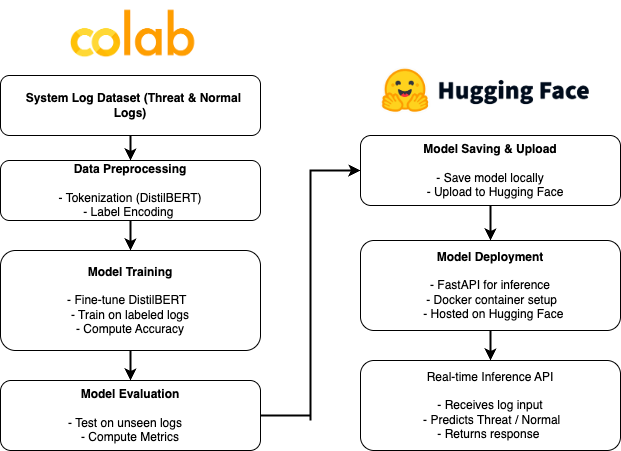

# 🚀 AI-Powered Cybersecurity: Threat Detection with Fine-Tuned DistilBERT



## 🔥 Overview

This project serves as a demonstration of how to **fine-tune an LLM** for threat detection in system logs. The goal is to showcase how **AI can enhance cybersecurity** by detecting threats in system logs. In future iterations, we plan to dive deeper by experimenting with different parameters, datasets, and optimization techniques to enhance its effectiveness.


# 🛠️ What We Built

- Fine-tuned **DistilBERT** on a small logs dataset, demonstrating its potential for **real-world threat detection** in cybersecurity.

- **Optimized & evaluated** the model for accuracy and efficiency in identifying threats.

- **Deployed & tested** real-time inference using **Flask & ngrok** on Google Colab.

- **Made it publicly accessible** by pushing to **Hugging Face** and hosting via **FastAPI on Hugging Face Spaces**—a **zero-cost deployment** for easy integration.

---

## 📌 How It Works

1️⃣ **Dataset Preparation**: Created a small cybersecurity dataset with labeled logs (Threat & Normal), this is a small dataset to showcase the solution only.

2️⃣ **Fine-Tuning DistilBERT**: Trained the model to classify logs as Threat (1) or Normal (0). 

3️⃣ **Inference & Testing**: Deployed a local API using Flask & ngrok for real-time testing. 

4️⃣ **Saving & Sharing the Model**: The fine-tuned model is saved and prepared for deployment.

---

## 🔧 Step-by-Step Guide

### [CHECKOUT THE cyberAI.ipynb FILE FOR THE COMPLETE code]

### 📥 1. Install Dependencies

Run this in Google Colab (Model finetuning & training on Colab):

```bash
!pip install --upgrade pip
from google.colab import drive
drive.mount('/content/drive')

!pip uninstall google-cloud-storage numpy

!pip install google-cloud-storage==2.10.0
!pip install numpy==1.26.4

!pip install transformers datasets torch evaluate scikit-learn flask joblib mlflow peft accelerate bitsandbytes
```

### 📊 2. All the necessary imports & Prepare a Sample Cybersecurity Dataset

```python
import torch
import random
import numpy as np
from transformers import AutoTokenizer, AutoModelForSequenceClassification, TrainingArguments, Trainer
from datasets import Dataset, DatasetDict
import evaluate
import os


data = {
    "text": [
        "The system detected a possible intrusion attempt.",
        "User logged in successfully.",
        "Suspicious network activity was observed.",
        "Firewall blocked a malicious request.",
        "Normal system operation detected."
    ],
    "label": [1, 0, 1, 1, 0]
}

dataset = Dataset.from_dict(data)
```

### 🏋️ 3. Load & Fine-Tune DistilBERT

```python
# Load a Small Model & Tokenizer
model_name = "distilbert-base-uncased"
tokenizer = AutoTokenizer.from_pretrained(model_name)

# Add Padding Token
tokenizer.add_special_tokens({'pad_token': '[PAD]'})
model = AutoModelForSequenceClassification.from_pretrained(model_name, num_labels=2)
model.resize_token_embeddings(len(tokenizer))  # Resize embeddings

# Tokenization Function
def tokenize_function(example):
    return tokenizer(example["text"], padding="max_length", truncation=True)

# Apply tokenization
tokenized_dataset = dataset.map(tokenize_function, batched=True)
```

- Fine-tune the model:

```python
# Split Dataset into Train & Test
split_data = tokenized_dataset.train_test_split(test_size=0.2, seed=42)
train_dataset = split_data["train"]
test_dataset = split_data["test"]

# Define Training Arguments
training_args = TrainingArguments(
    output_dir="./results",
    evaluation_strategy="epoch",
    save_strategy="epoch",
    per_device_train_batch_size=8,
    per_device_eval_batch_size=8,
    num_train_epochs=5,
    weight_decay=0.01,
    logging_dir="./logs",
    logging_steps=10,
    load_best_model_at_end=True,
)

# Define Accuracy Metric
metric = evaluate.load("accuracy")

def compute_metrics(eval_pred):
    logits, labels = eval_pred
    predictions = np.argmax(logits, axis=-1)
    return metric.compute(predictions=predictions, references=labels)

# Train the Model
trainer = Trainer(
    model=model,
    args=training_args,
    train_dataset=train_dataset,
    eval_dataset=test_dataset,
    compute_metrics=compute_metrics,
)

# Disable Weights & Biases logging
os.environ["WANDB_DISABLED"] = "true"

trainer.train()

```

### 💾 4. Save the Fine-Tuned Model in Colab & Download it to local system

```python
# Save the Model
model.save_pretrained("./fine_tuned_model")
tokenizer.save_pretrained("./fine_tuned_model")

# Detect the available device
device = torch.device("cuda" if torch.cuda.is_available() else "cpu")

# Move model to the same device
model.to(device)

# Download to local system
from google.colab import files
files.download("fine_tuned_model.zip")

```

---


## 🚀 Upload Model to Hugging Face (Recommended)

### 1️⃣ Create a Hugging Face Account

- Go to [**Hugging Face**](https://huggingface.co/join) and sign up.
- Generate an access token from [**Hugging Face Tokens**](https://huggingface.co/settings/tokens) with **Write** permissions.

### 2️⃣ Install `huggingface_hub`

```sh
pip install huggingface_hub
```

### 3️⃣ Log In to Hugging Face

```sh
huggingface-cli login
```

Or, in Python:

```python
from huggingface_hub import login
login("hf_xxxxxxxxxxxxxxxxxxxx")  # Replace with your token
```

### 4️⃣ Create a Model Repository on Hugging Face

- Go to [**Hugging Face Hub**](https://huggingface.co/)
- Click on your profile picture → **New Repository**
- **Repository name:** `cyberai-threat-detection`
- **Select repository type:** **Model**
- **Visibility:** Public (or Private if needed)
- Click **Create Repository**

### 5️⃣ Upload Your Model to Hugging Face

- Remember for this we must have downloded our finetuned model on our local system
- Now you can use the "load_model_to_huggingface.py" to load the model to Huggingface
- Change the repository name in this code to upload to your corresponding repository

```python
from huggingface_hub import HfApi
from transformers import AutoModelForSequenceClassification, AutoTokenizer

repo_id = "your_username/cyberai-threat-detection"
api = HfApi()
api.create_repo(repo_id=repo_id, exist_ok=True)

model_path = "./fine_tuned_model"
model = AutoModelForSequenceClassification.from_pretrained(model_path)
tokenizer = AutoTokenizer.from_pretrained(model_path)

model.push_to_hub(repo_id)
tokenizer.push_to_hub(repo_id)

print("🎉 Model uploaded successfully!")
```

### 6️⃣ Verify Your Model

Your model will be available at: 🔗 [**https://huggingface.co/your\_username/cyberai-threat-detection**](https://huggingface.co/your_username/cyberai-threat-detection)

You can now load your model from anywhere using:

```python
from transformers import AutoModelForSequenceClassification, AutoTokenizer

model_name = "your_username/cyberai-threat-detection"  # Hugging Face model name
tokenizer = AutoTokenizer.from_pretrained(model_name)
model = AutoModelForSequenceClassification.from_pretrained(model_name)
```

For example you can load the model I uploaded on huggingface (It's publicly available)

```python
# Load Hugging Face model
model_name = "Visionmat/cyberai-threat-detection"
tokenizer = AutoTokenizer.from_pretrained(model_name)
model = AutoModelForSequenceClassification.from_pretrained(model_name)
```

Now, your API will automatically fetch the model from Hugging Face. 🎯

---

## 📦 Deploying FastAPI with Docker on Hugging Face Spaces

📂 project-folder/

├── 📄 app.py          # FastAPI application

├── 📄 Dockerfile      # Docker configuration

├── 📄 requirements.txt # Python dependencies


### 🛠️ Steps to Deploy

### 1️⃣ Create a New Space on Hugging Face
1. Go to [Hugging Face Spaces](https://huggingface.co/spaces)
2. Click **New Space** and enter a name for your project.
3. Set **SDK** to `Docker`.
4. Choose a visibility option (Public/Private).
5. Click **Create Space** (You will get the repository name once done).

### 2️⃣ Clone Your Hugging Face Space Repository
1. Copy the repository URL from your Hugging Face Space.
2. Clone the repository to your local machine:

```sh
git clone https://huggingface.co/spaces/YOUR_USERNAME/YOUR_SPACE_NAME
cd YOUR_SPACE_NAME
```

3. Copy your project files into the cloned directory and commit the changes. So here we 
   will be copying the following files from this repo (feel free to make changes) : 
   - Dockerfile
   - app.py
   - requirements.txt

```sh
cp -r /path/to/your/project/* .
git add .
git commit -m "Initial commit"
git push
```

### 3️⃣ Hugging Face Automatically Builds and Deploys
- Once the repository is pushed, Hugging Face Spaces will automatically build and run the Docker container.
- Your FastAPI app will be accessible at: `https://YOUR_SPACE_NAME.hf.space`
- In our case the FastAPI app will be accessible publicly at: https://visionmat-cyberai-api.hf.space/predict


## 🐳 Dockerfile that we will deploy

```dockerfile
# Use the recommended Python version
FROM python:3.9

# Create a non-root user
RUN useradd -m -u 1000 user
USER user

# Set environment variable for user PATH
ENV PATH="/home/user/.local/bin:$PATH"

# Set the working directory
WORKDIR /app

# Copy and install dependencies
COPY --chown=user ./requirements.txt requirements.txt
RUN pip install --no-cache-dir --upgrade -r requirements.txt

# Copy the app files
COPY --chown=user . /app

# Expose the port (not strictly needed since Spaces sets it dynamically)
EXPOSE 7860

# Start FastAPI with Uvicorn using the dynamic port
CMD ["uvicorn", "app:app", "--host", "0.0.0.0", "--port", "7860"]
```

---

## 🧪 Testing the Deployment

Once your FastAPI app is live on Hugging Face Spaces, you can test it using `curl`:
- Below we execute the curl command for the API url that I have hosted
- This is a public url and it should return the response

```sh
curl -X 'POST' \
  'https://visionmat-cyberai-api.hf.space/predict' \
  -H 'Content-Type: application/json' \
  -d '{"text": "Suspicious network activity was observed."}'
```

### ✅ Expected Response:
```json
{"prediction":"Threat"}
```

If you receive a valid response, your deployment is working correctly! 🚀 
If there are any issues, check the **Logs** section in your Hugging Face Space.
In the curl command you are encouraged to test your own public API url.